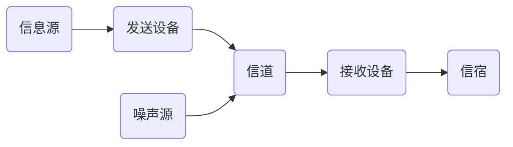

# 第1章  绪论

## 1.1 通信的基本概念

## 1.2 通信的发展史

## 1.3 通信系统的组成

### 1.3.1 通信系统的一般模型




> 现实中噪声源不一定都在信道中


### 1.3.2 模拟通信系统与数字通信系统

> 几点说明：
>
> 1. 模拟信号vs数字信号
>    - 模拟信号：**代表消息的信号参量取值连续**。例如：麦克风输出电压、由模拟信号采样所得的抽样信号
>    - 数字信号：**代表消息的信号参量取值为有限个**。例如：二进制信号、[2PSK信号（代表消息的信号参量为相位）]([http://image.baidu.com/search/detail?ct=503316480&z=0&ipn=d&word=2PSK%E4%BF%A1%E5%8F%B7&step_word=&hs=2&pn=1&spn=0&di=13860&pi=0&rn=1&tn=baiduimagedetail&is=0%2C0&istype=2&ie=utf-8&oe=utf-8&in=&cl=2&lm=-1&st=-1&cs=730214525%2C787302250&os=3242772133%2C1359087311&simid=3417125613%2C222725427&adpicid=0&lpn=0&ln=307&fr=&fmq=1584259163036_R&fm=result&ic=&s=undefined&hd=&latest=&copyright=&se=&sme=&tab=0&width=&height=&face=undefined&ist=&jit=&cg=&bdtype=0&oriquery=&objurl=http%3A%2F%2Fgss0.baidu.com%2F-vo3dSag_xI4khGko9WTAnF6hhy%2Fzhidao%2Fpic%2Fitem%2F2cf5e0fe9925bc31d97d21365edf8db1cb13707f.jpg&fromurl=ippr_z2C%24qAzdH3FAzdH3Fzit1w5_z%26e3Bkwt17_z%26e3Bv54AzdH3Fq7jfpt5gAzdH3F99cmambc0_z%26e3Bip4s&gsm=2&rpstart=0&rpnum=0&islist=&querylist=&force=undefined](http://image.baidu.com/search/detail?ct=503316480&z=0&ipn=d&word=2PSK信号&step_word=&hs=2&pn=1&spn=0&di=13860&pi=0&rn=1&tn=baiduimagedetail&is=0%2C0&istype=2&ie=utf-8&oe=utf-8&in=&cl=2&lm=-1&st=-1&cs=730214525%2C787302250&os=3242772133%2C1359087311&simid=3417125613%2C222725427&adpicid=0&lpn=0&ln=307&fr=&fmq=1584259163036_R&fm=result&ic=&s=undefined&hd=&latest=&copyright=&se=&sme=&tab=0&width=&height=&face=undefined&ist=&jit=&cg=&bdtype=0&oriquery=&objurl=http%3A%2F%2Fgss0.baidu.com%2F-vo3dSag_xI4khGko9WTAnF6hhy%2Fzhidao%2Fpic%2Fitem%2F2cf5e0fe9925bc31d97d21365edf8db1cb13707f.jpg&fromurl=ippr_z2C%24qAzdH3FAzdH3Fzit1w5_z%26e3Bkwt17_z%26e3Bv54AzdH3Fq7jfpt5gAzdH3F99cmambc0_z%26e3Bip4s&gsm=2&rpstart=0&rpnum=0&islist=&querylist=&force=undefined))
>    
> 2. 基带通信系统vs带通（频带）通信系统
>
>    以下判定条件适用于数字通信系统和模拟通信系统：
>
>    - 包含调制器和解调器则为带通（频带）通信系统
>    - 不包含调制器和解调器则为基带通信系统
- 模拟通信系统

    ```mermaid
    graph LR
    a(模拟信息源)-->b(发送设备)-->c(信道)-->d(接收设备)-->e(受信者) 
    f(噪声源)-->c
    ```
- 数字通信系统
    ```mermaid
    graph TD
    1(信息源)-->2(信源编码)-->3(加密)-->4(信道编码)-->5(数字调制)-->6(信道)-->7(数字解调)-->8(信道译码)-->9(解密)-->10(信源译码)-->11(受信者)
    12(噪声源)-->6
    ```
    - 信源编码和译码的目的：1.提高信息传输的有效性；2.完成数/模和模/数转换
    - 信道编码与译码的目的：增强抗干扰的能力（即可靠性）
    - 加密和解密的目的：保证信息的安全
    - 数字调制与解调的目的：形成适合在信道中传输的带通信号
    - 同步目的：使收发两端的信号在时间上保持一致
### 1.3.3 数字通信的特点

- 优点
  1. 抗干扰能力强，且噪声不可积累
  2. 传输差错可控
  3. 便于处理、变换、存储
  4. 便于将来自不同信源的信号综合到一起传输
  5. 便于集成，使通信设备微型化，重量轻
  6. 易于加密处理且保密性好
- 缺点
  1. 需要较大的传输带宽
  2. 对同步要求高


## 1.4 通信系统的分类与通信方式

### 1.4.1 通信系统的分类

1. 按通信业务
2. 按调制方式
3. 按信号特征
4. 按传输媒介
5. 按工作波段
6. 按信号复用

> 各种复用方式：
>
> 1. 频分多路
> 2. 时分多路
> 3. 码分多路
> 4. 波分多路
> 5. 空分多路
> 6. 轨道角动量
> 7. 极化

### 1.4.2 通信方式

1. 单工通信
2. 双工通信
3. 全双工通信
4. 其他方式
   - 并行与串行
   - 同步与异步
   - 专线与网通信

## 1.5 通信系统的度量及性能指标

### 1.5.1 信息及其度量

- 度量信息量的原则

  1. 能度量任何消息，且与消息的种类无关
  2. 度量方法应与消息的重要程度无关
  3. 消息中所含信息量与消息的不确定性有关

- 度量信息量的方法

  1. 单个符号信息量：$I(x)=log_aP(x)$

  2. 熵：$H(x)=-\sum_{i=1}^{m}P(x_i)log_aP(x_i)$

     > H(x)的单位:
     >
     > a=2 $\to $ bit
     >
     > a=e $\to $ nat
     >
     > a=10 $\to$ 哈特莱

### 1.5.2 通信系统性能指标

> 通信系统的主要性能指标：有效性和可靠性
>
> - 有效性：传输一定信息量所占用的信道资源，即指“传输速度”
> - 可靠性：接收信息的准确程度，即指“传输质量”

- 模拟通信系统

  - 有效性：用有效传输频带来度量
  - 可靠性：接收端最终输出信噪比来度量

- 数字通信系统

  - 有效性：传输速率和频带利用率来衡量

    1. 码元传输速率$R_B$：单位时间（每秒）传送码元的数目，单位为波特（Baud），简记为B

		   $R_B=\frac{1}{T}$
		
		2. 信息传输速率$R_b$：单位时间内传递的平均信息量或比特数，单位为比特/秒，简记为b/s
		
		3. 码元速率与信息速率的关系：
		   $$
		   R_b=R_Blog_2m\ (b/s)\\
		   R_B=\frac{R_b}{log_2m}\ (B)\\
		   $$
		   
		
		   
		
		

## 小结

